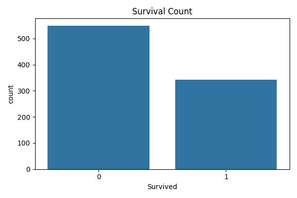
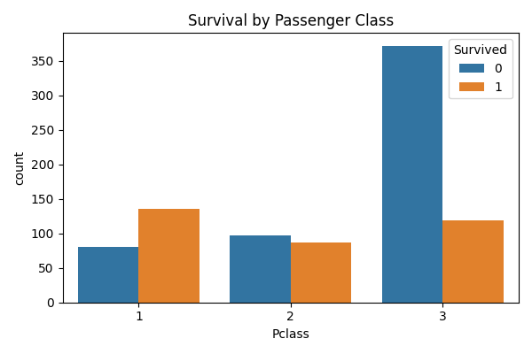
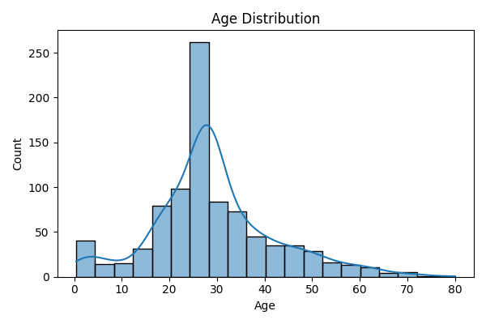
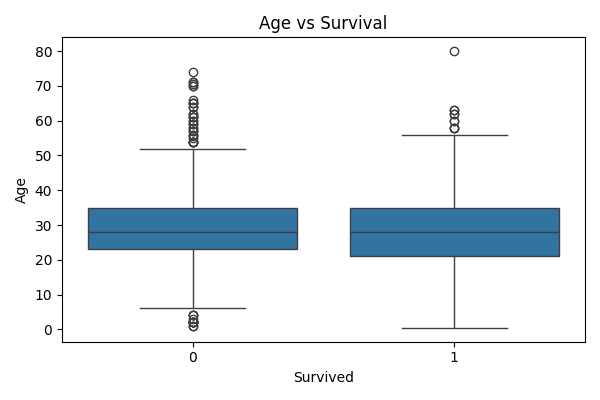
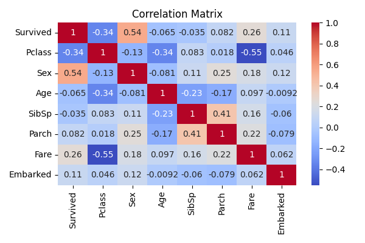

# Task 2: Data Cleaning & Exploratory Data Analysis (EDA) - Titanic Dataset

This project involves data cleaning and exploratory data analysis (EDA) using the **Titanic dataset** from Kaggle. The goal is to uncover patterns and relationships among variables, particularly focusing on survival.

## 📊 Objective

- Perform data cleaning to handle missing and irrelevant data.
- Conduct exploratory data analysis to explore variable distributions, correlations, and survival factors.

## 🧾 Dataset

The Titanic dataset contains information on passengers, such as:

- Passenger class (Pclass)
- Sex
- Age
- Number of siblings/spouses aboard (SibSp)
- Number of parents/children aboard (Parch)
- Fare
- Port of embarkation (Embarked)
- Survival status

## 🧹 Data Cleaning Steps

- Dropped irrelevant columns: `PassengerId`, `Name`, `Ticket`, `Cabin`
- Filled missing values in:
  - `Age` with median
  - `Embarked` with mode
- Encoded categorical variables:
  - `Sex`: male = 0, female = 1
  - `Embarked`: S = 0, C = 1, Q = 2

## 🛠️ Technologies Used

- Python
- Pandas
- Seaborn
- Matplotlib

## 📈 Visualizations

- **Survival Count**

  

- **Survival by Passenger Class**

  

- **Age Distribution**

  

- **Age vs Survival (Box Plot)**

  

- **Correlation Heatmap**

  

## 🔍 Insights

- Higher survival rates were observed in 1st class and among females.
- Age shows a slightly different distribution for survivors vs non-survivors.
- Positive correlation between survival and being female, and negative correlation with `Pclass`.

## 🚀 How to Run

1. Clone this repo
2. Ensure `dataset.csv` is in the root directory
3. Run the script:

```bash
python script.py
```

## ✅ Task Completed
1. Cleaned the dataset
2. Performed EDA with visual insights
3. Identified variable relationships and survival patterns
